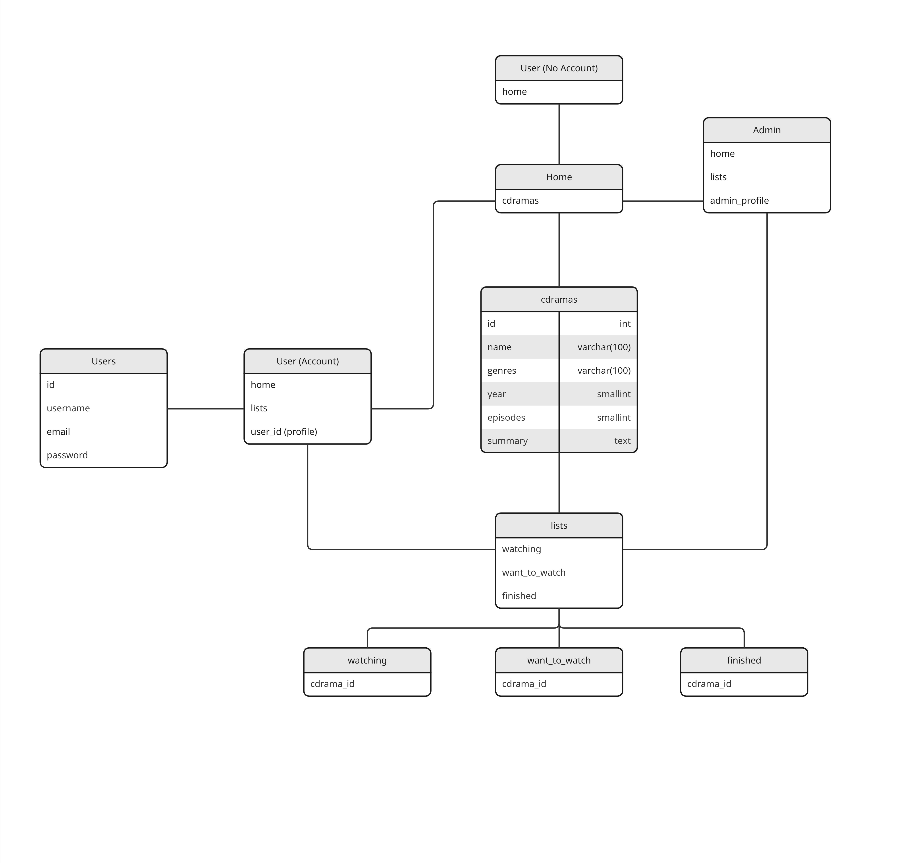
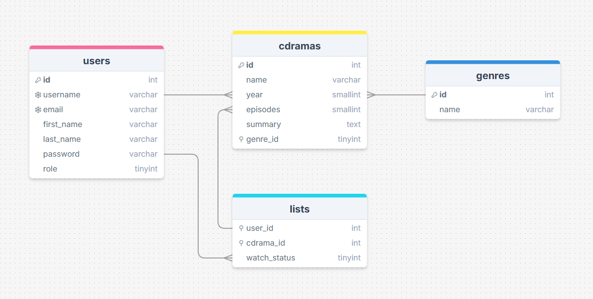
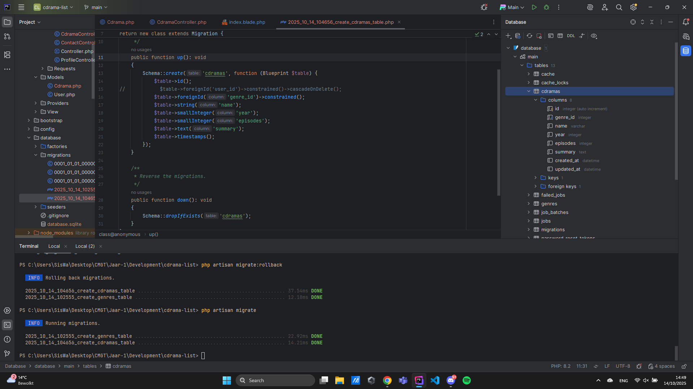
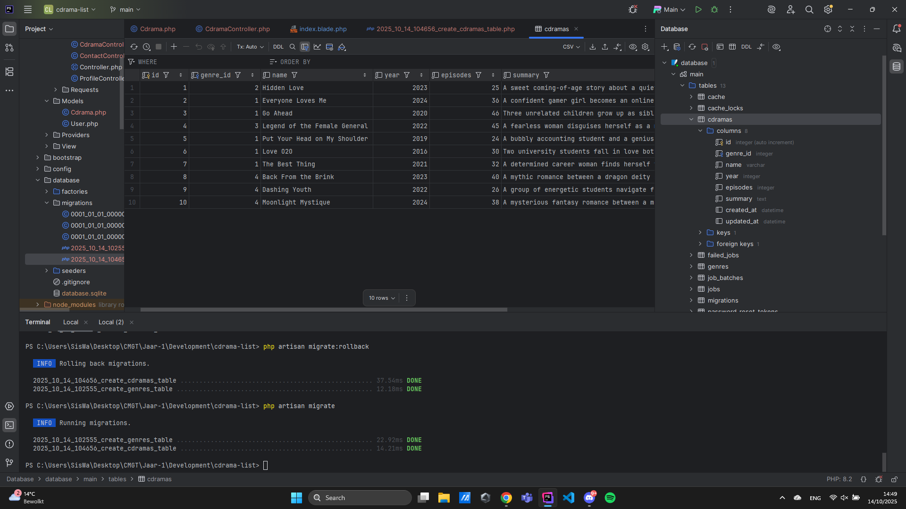
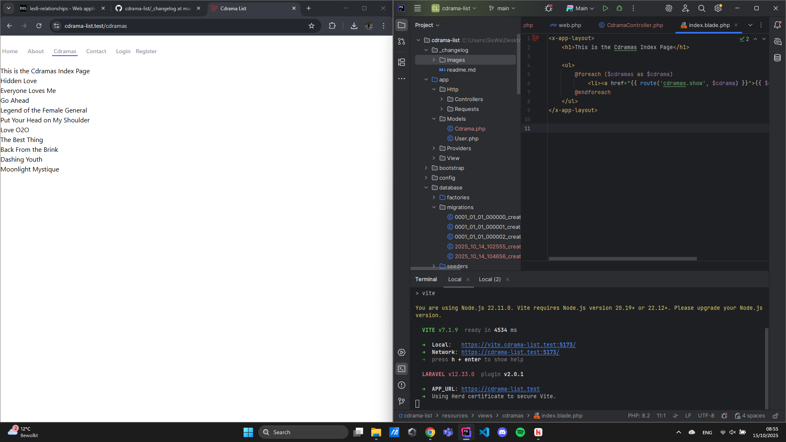
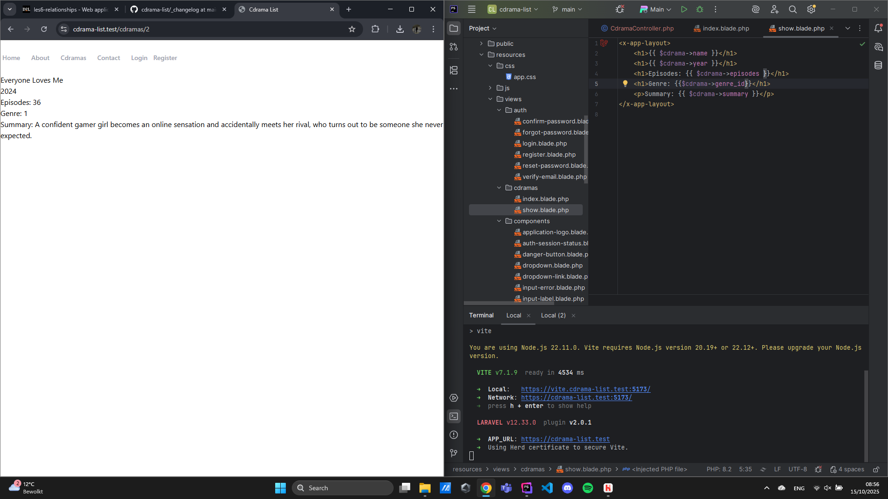
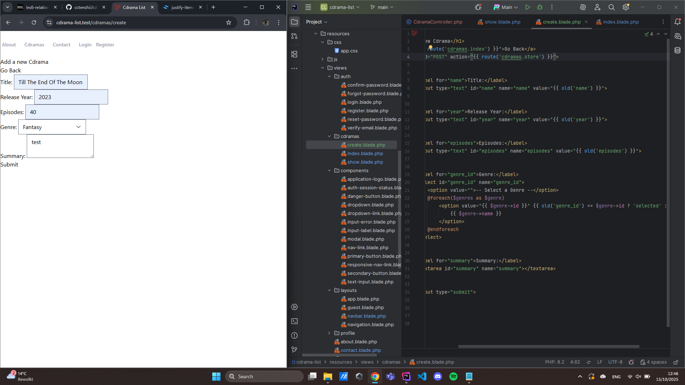
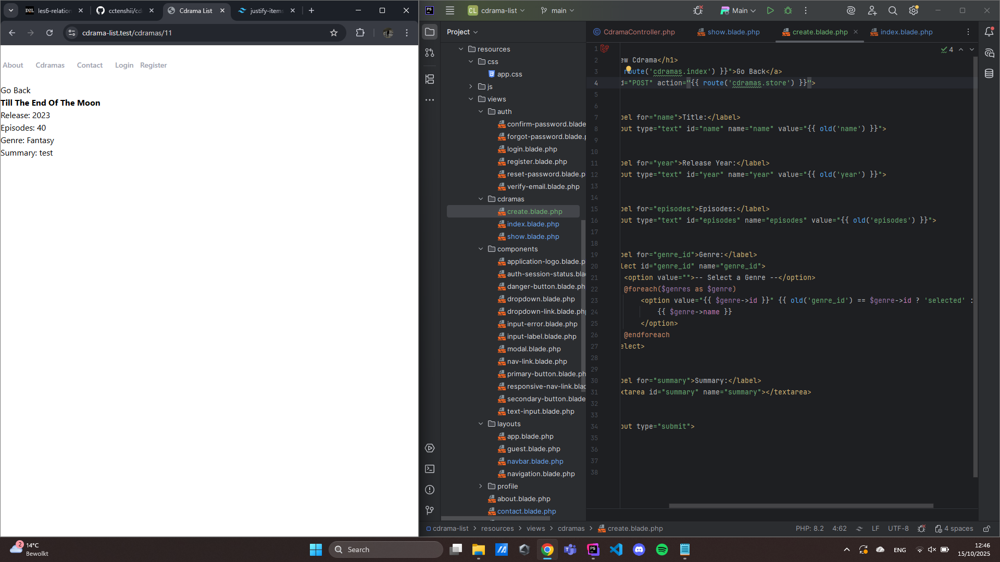

# 11-10-2025
## User Stories
### Publieke gebruiker (niet ingelogd)

Als bezoeker wil ik een lijst met C-dramas kunnen zien, zodat ik snel een overzicht krijg van wat er beschikbaar is.

Als bezoeker wil ik via een zoekbalk kunnen zoeken op titel of acteur, zodat ik snel een specifieke C-drama kan vinden.

Als bezoeker wil ik op een C-drama kunnen klikken, zodat ik meer informatie kan zien (zoals synopsis, aantal afleveringen, genre, jaar, cast, etc.).

Als bezoeker wil ik gerelateerde C-dramas of aanbevelingen kunnen zien, zodat ik nieuwe series kan ontdekken.

Als bezoeker wil ik een login- of registratieknop zien, zodat ik weet hoe ik een account kan aanmaken.

### Geregistreerde gebruiker (ingelogd)

Als gebruiker wil ik een account kunnen aanmaken en inloggen, zodat ik mijn eigen lijst kan beheren.

Als gebruiker wil ik een C-drama kunnen toevoegen aan mijn persoonlijke lijst, zodat ik kan bijhouden wat ik kijk of wil kijken.

Als gebruiker wil ik mijn lijst kunnen organiseren in categorieën zoals Currently Watching, Want to Watch, Finished, zodat ik overzicht hou over mijn voortgang.

Als gebruiker wil ik C-dramas uit mijn lijst kunnen verwijderen of verplaatsen, zodat ik mijn lijst up-to-date kan houden.

Als gebruiker wil ik zelf een nieuwe C-drama kunnen toevoegen aan de database (met titel, beschrijving, genre, etc.), zodat ik content kan bijdragen als het nog niet op de website staat.

Als gebruiker wil ik mijn profiel kunnen bekijken en eventueel aanpassen, zodat ik mijn gegevens en voorkeuren kan beheren.

Als gebruiker wil ik mijn voortgang kunnen zien (bijv. hoeveel dramas ik heb afgerond), zodat ik mijn kijkgeschiedenis kan bijhouden.

### Beheer / community validatie (optioneel)

Als beheerder wil ik nieuwe door gebruikers toegevoegde C-dramas kunnen goedkeuren of aanpassen, zodat de database betrouwbaar blijft.

Als beheerder wil ik foutieve of dubbele entries kunnen verwijderen, zodat de site schoon en overzichtelijk blijft.

### Extra (toekomstige uitbreidingen / nice-to-have)

Als gebruiker wil ik C-dramas kunnen beoordelen (sterren/rating) zodat ik mijn mening kan delen.

Als gebruiker wil ik reacties kunnen achterlaten op dramas, zodat ik met andere gebruikers kan praten over de serie.

Als gebruiker wil ik een overzichtspagina met mijn “stats” (zoals aantal bekeken dramas, gemiddelde rating, etc.), zodat ik inzicht krijg in mijn kijkgedrag.

# 13-10-25
## ERD
### V1

### V2 (met behulp van Antwan)

# 14-10-25
## Database
### Cdramas Tabel aangemaakt en gevuld

## List Overview
### Cdramas uit database opgehaald en in website gezet + link naar overzicht per drama

# 15-10-25
## Create Form
### Formulier gemaakt en werkend

